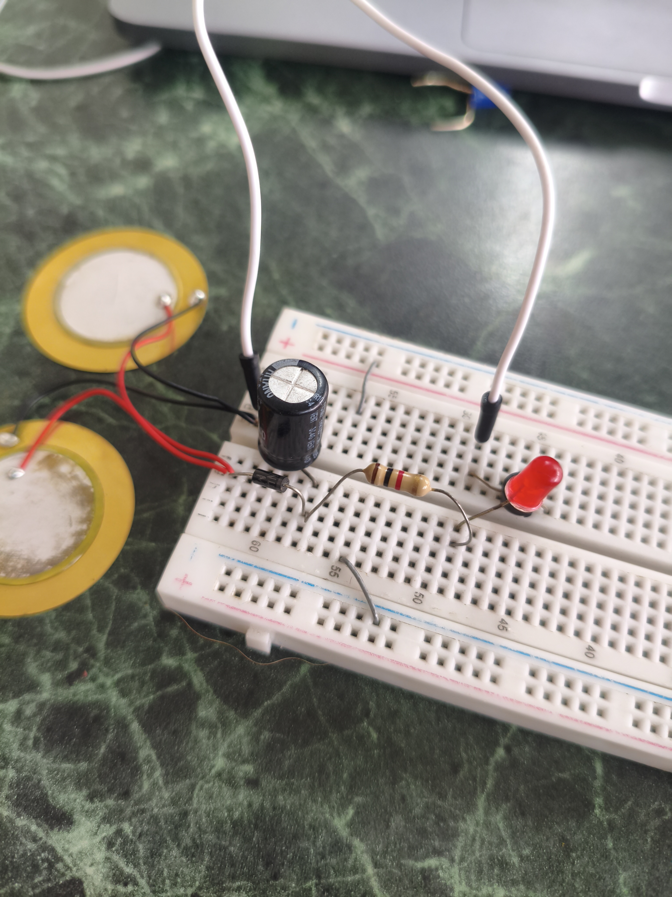
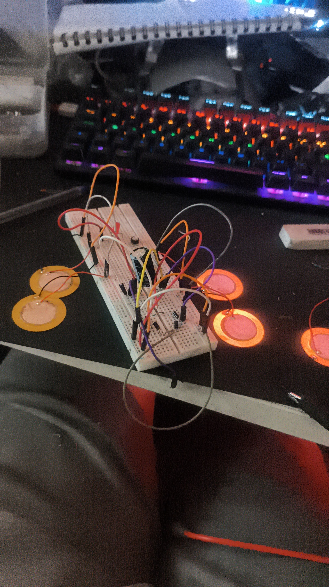
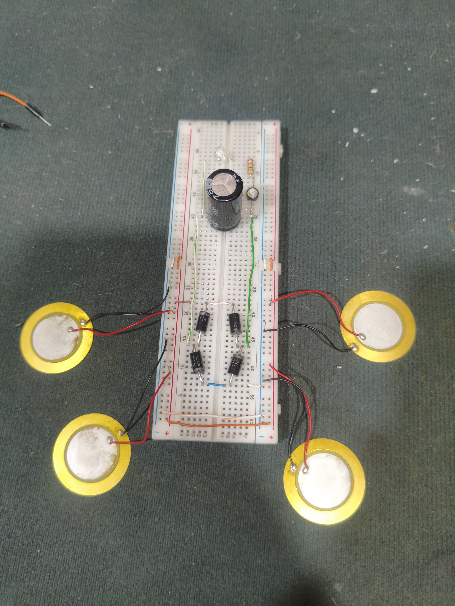
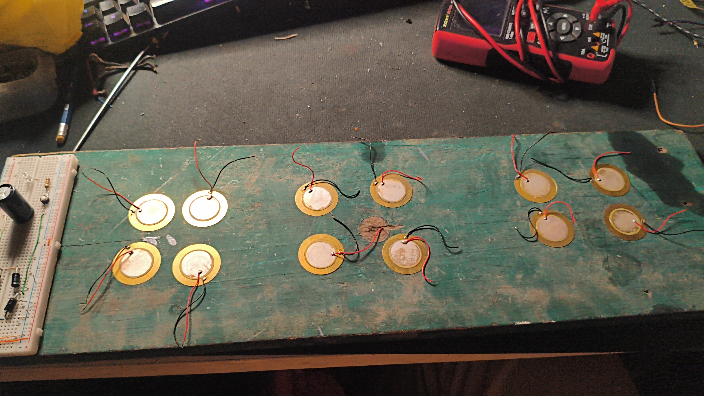
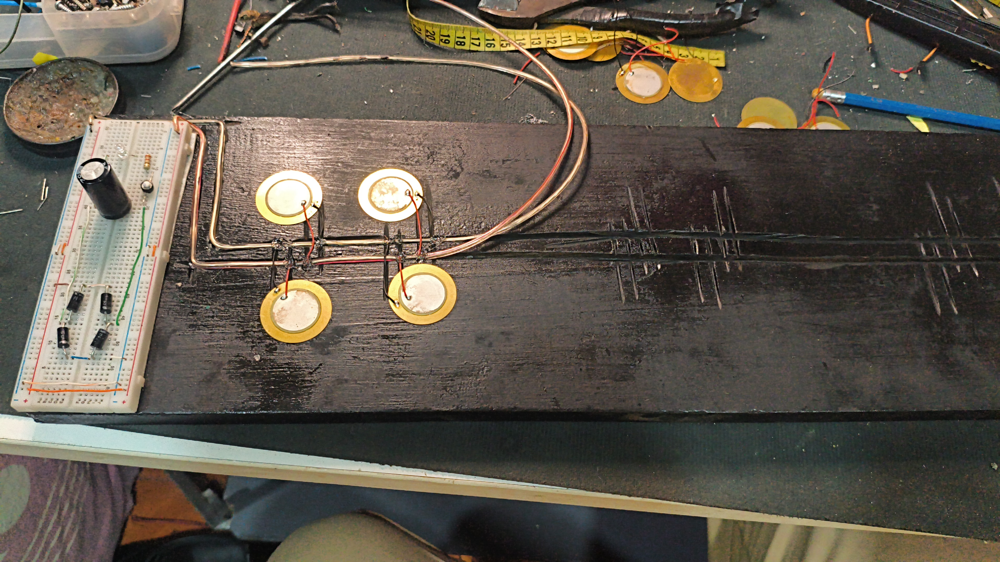
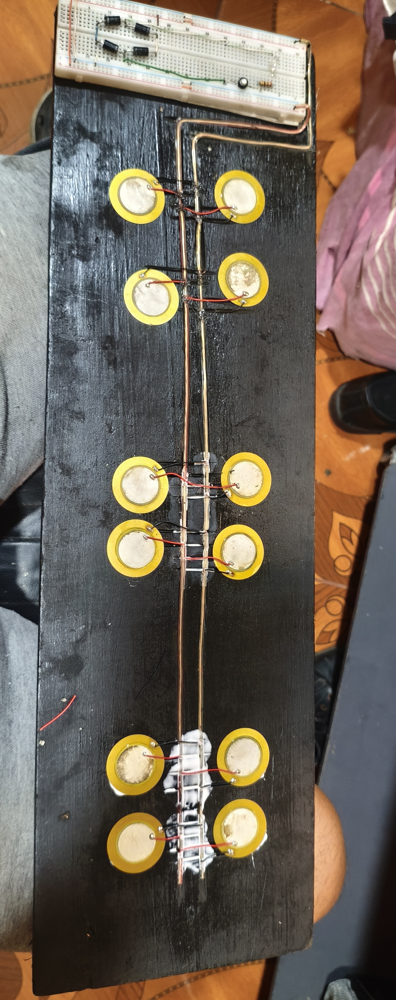
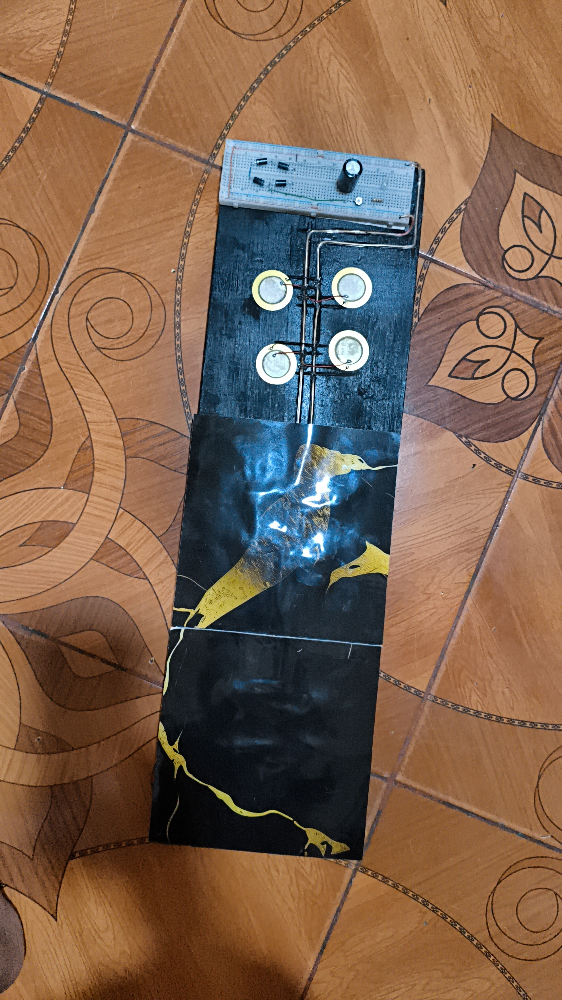
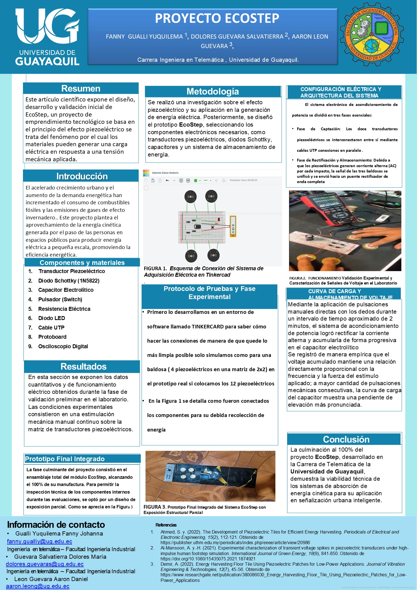

# 🌱 EcoStep - Sistema de Generación de Energía mediante Pisadas

## 📖 Descripción

EcoStep es un proyecto orientado al aprovechamiento de la energía mecánica generada por las pisadas de las personas mediante sensores piezoeléctricos.

El sistema convierte la presión ejercida sobre una plataforma en energía eléctrica, la cual es rectificada mediante diodos Schottky, almacenada temporalmente y posteriormente puede utilizarse para alimentar dispositivos electrónicos de baja potencia.

Este proyecto busca demostrar la viabilidad de utilizar tecnologías sostenibles para la generación de energía en lugares con alto tránsito peatonal.

---

## 🎯 Objetivos

### Objetivo general

Diseñar e implementar un sistema capaz de generar energía eléctrica mediante sensores piezoeléctricos instalados en una plataforma de tránsito peatonal.

### Objetivos específicos

- Diseñar una plataforma para la instalación de sensores piezoeléctricos.
- Capturar energía mecánica producida por las pisadas.
- Rectificar la señal generada utilizando diodos Schottky.
- Almacenar la energía generada mediante capacitores.
- Analizar el comportamiento eléctrico del sistema.
- Evaluar posibles aplicaciones del prototipo.

---

## ⚠️ Problema

Cada día miles de personas caminan sobre superficies donde la energía mecánica generada por sus pasos se desperdicia.

EcoStep propone aprovechar esa energía mediante sensores piezoeléctricos para convertirla en energía eléctrica útil, contribuyendo al desarrollo de soluciones energéticas sostenibles.

---

## ⚙️ Funcionamiento

Cuando una persona pisa la plataforma, los sensores piezoeléctricos generan pequeños pulsos de voltaje.

El sistema realiza el siguiente proceso:

1. Captación de energía mediante discos piezoeléctricos.
2. Rectificación de la señal utilizando diodos Schottky.
3. Almacenamiento temporal de la energía en capacitores.
4. Entrega de energía a una carga o sistema de almacenamiento.

---

## 🔧 Componentes utilizados

- 12 discos piezoeléctricos.
- Diodos Schottky (1N5819).
- Capacitor electrolítico de 2200 µF / 35 V.
- Osciloscopio Zoyi ZT-702S.
- Protoboard.
- Conductores eléctricos.
- Plataforma de pruebas.
- 1 Led de alta luminosidad.
- 1 Pulsador.

---

## 💡 Selección de los diodos

Se utilizaron diodos Schottky debido a su baja caída de tensión directa (aproximadamente 0.2 V a 0.3 V), permitiendo aprovechar una mayor cantidad de energía generada por los sensores piezoeléctricos en comparación con diodos rectificadores convencionales.

---

## 🧪 Pruebas realizadas

Durante el desarrollo del proyecto se realizaron diversas pruebas para evaluar el funcionamiento del sistema:

- Medición del voltaje generado por un sensor piezoeléctrico.
- Medición utilizando múltiples sensores conectados.
- Análisis de la señal mediante osciloscopio.
- Evaluación del almacenamiento de energía en capacitores.
- Comparación de diferentes configuraciones de conexión.

---

## 📊 Resultados

Las pruebas demostraron que los sensores piezoeléctricos son capaces de generar pulsos eléctricos aprovechables mediante un sistema de rectificación y almacenamiento.

Aunque la energía obtenida es limitada, el prototipo demuestra la viabilidad del aprovechamiento de energía mecánica para aplicaciones de baja potencia.

---

## 🌍 Aplicaciones

- Centros comerciales.
- Aeropuertos.
- Escuelas.
- Universidades.
- Estadios.
- Estaciones de transporte.
- Pasillos de alto tránsito.

---

## 📚 Conocimientos aplicados

- Electrónica analógica.
- Instrumentación electrónica.
- Energías renovables.
- Sensores piezoeléctricos.
- Rectificación de señales.
- Almacenamiento de energía.
- Diseño de prototipos.

---

## 📷 Evidencias del proyecto

### 1. Primer prototipo

**Descripción:** Primera prueba del sistema utilizando dos sensores piezoeléctricos.

---

### 2. Prototipo con cuatro sensores

**Descripción:** Se incrementó el número de sensores para evaluar el comportamiento del sistema.

---

### 3. Circuito organizado

**Descripción:** Montaje del circuito sobre una protoboard para mejorar la organización de las conexiones.

---

### 4. Primera presentación

**Descripción:** Presentación del primer prototipo funcional.

---

### 5. Construcción de la plataforma

**Descripción:** Fabricación de la estructura principal del proyecto.

---

### 6. Instalación de los sensores

**Descripción:** Colocación de los sensores piezoeléctricos sobre la plataforma.

---

### 7. Prototipo terminado

**Descripción:** Plataforma completamente ensamblada y lista para las pruebas.

---

### 8. Póster científico

**Descripción:** Póster utilizado para la presentación del proyecto.

---

## 🎥 Video demostrativo

Puedes ver el funcionamiento del prototipo en el siguiente enlace:

▶️ https://youtube.com/shorts/GGRk2R6EDh4

## 👨‍💻 Autor

**Aaron Leon**

Estudiante de Ingeniería en Telemática.
