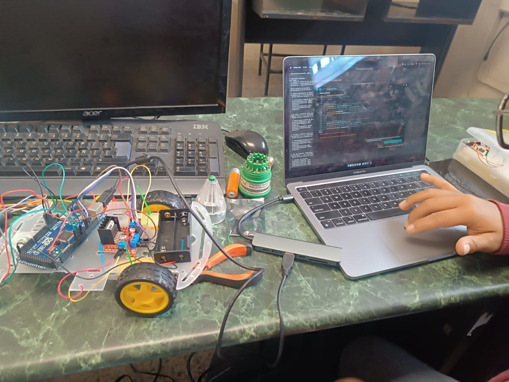
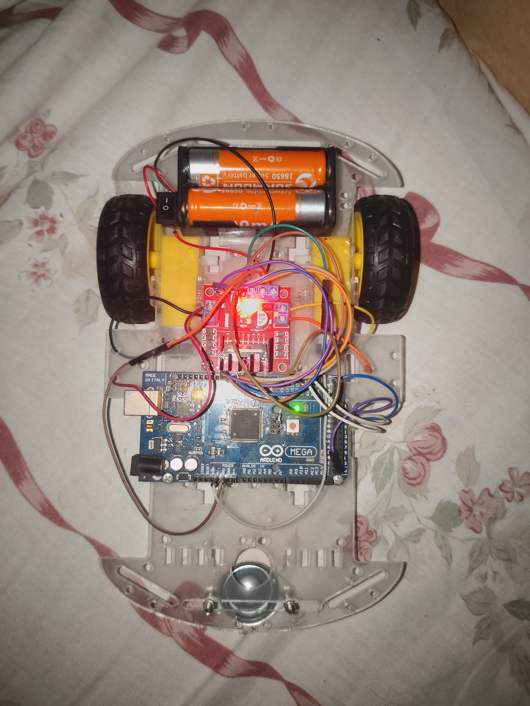
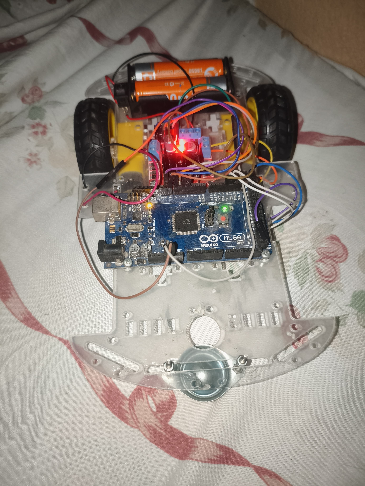

# 🚗 Carro Bluetooth con HC-05

## 📌 Descripción
Este proyecto consiste en un carro controlado por Bluetooth usando Arduino y el módulo HC-05.

## 🎯 Objetivo
Controlar un carro desde el celular mediante comandos Bluetooth.

## 🔧 Componentes
- Arduino (Mega o Uno)
- Módulo HC-05
- Driver L298N
- Motores DC
- Batería
- Chasis de 3 o 4 ruedas
- Porta bateria
- Cables jumper

## ⚙️ Funcionamiento
El módulo HC-05 recibe señales desde el celular y el Arduino controla los motores según los comandos.

## 🎮 Controles

- F → Adelante
- B → Atrás
- L → Izquierda
- R → Derecha
- S → Stop

- G → Adelante izquierda
- H → Adelante derecha
- I → Atrás izquierda
- J → Atrás derecha

- Y → Bocina

## 📷 Evidencia

## 🧠 Aprendizaje
- Comunicación Bluetooth
- Control de motores
- Programación en Arduino
