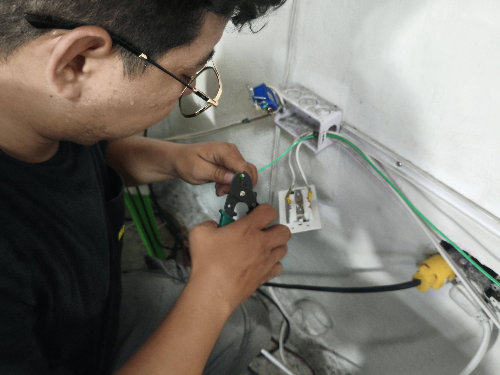
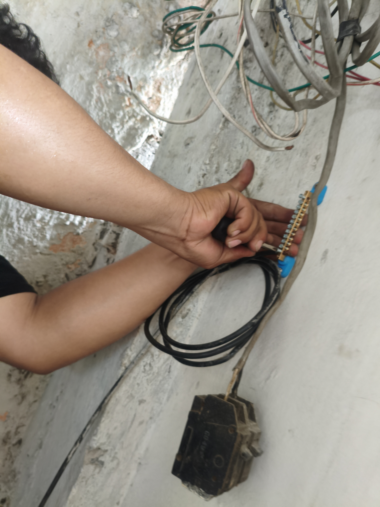
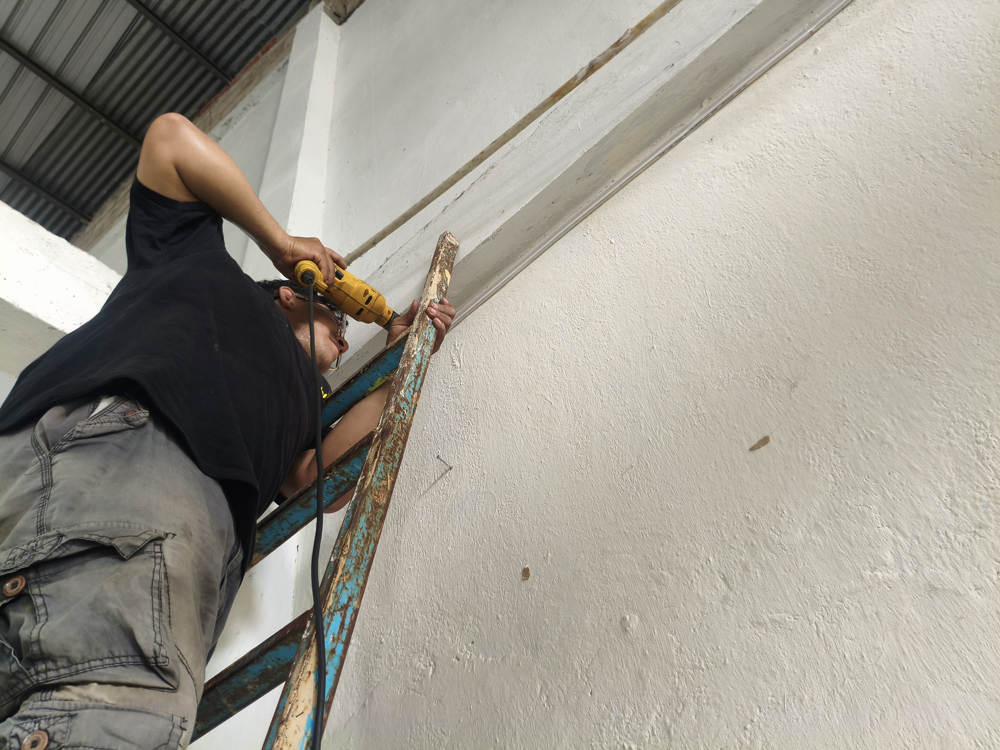
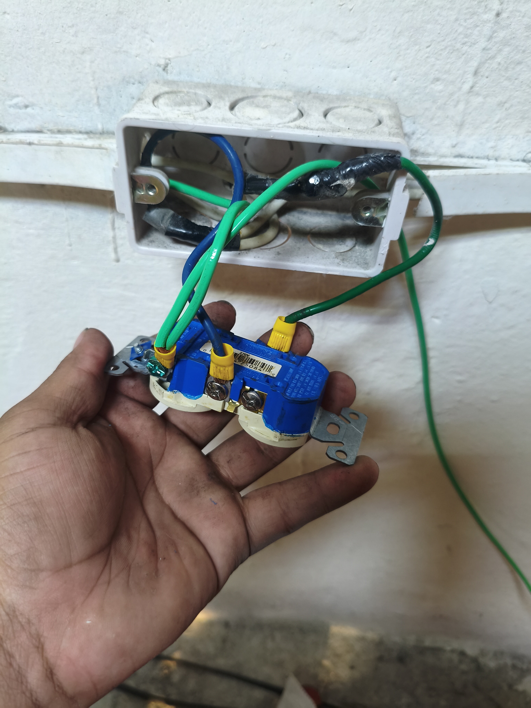
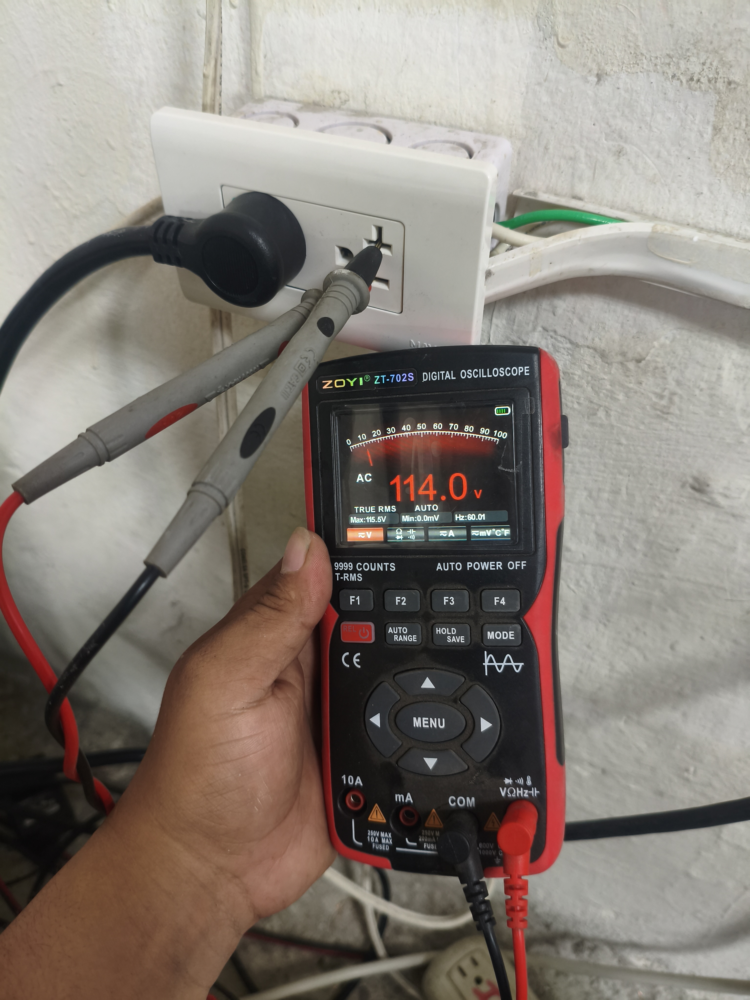
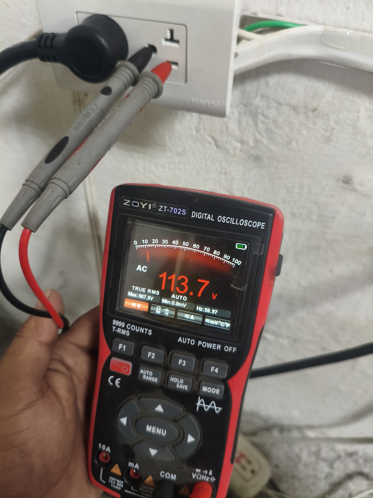
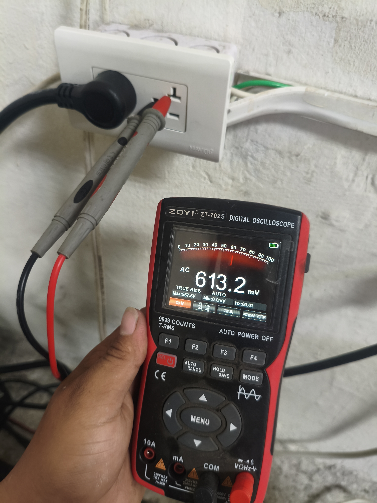
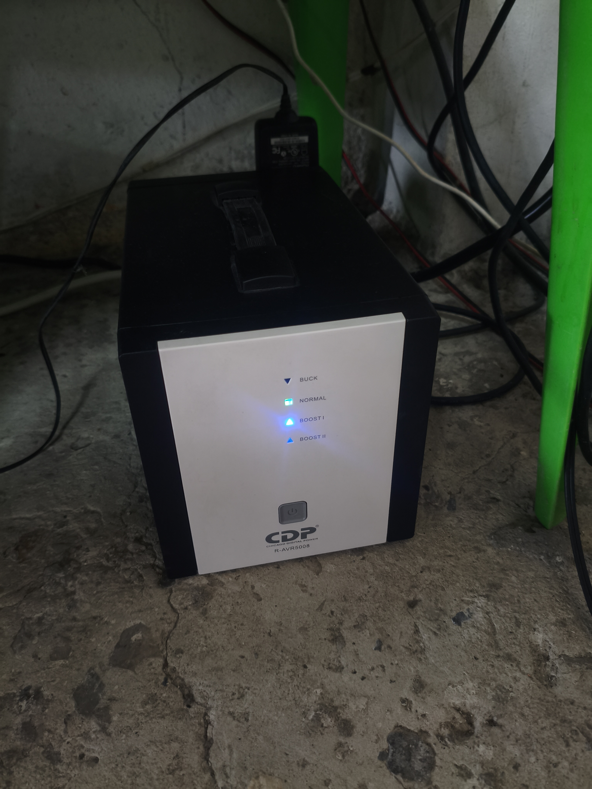

# ⚡ Diagnóstico y Optimización del Sistema Eléctrico para un Sistema de Audio en una Iglesia

## 📖 Descripción

Este proyecto documenta el proceso de diagnóstico, análisis y corrección de un problema de puesta a tierra en el sistema eléctrico de una iglesia, el cual provocaba descargas eléctricas en el sistema de audio y representaba un riesgo para los usuarios.

El trabajo consistió en identificar la causa del problema mediante inspecciones y mediciones eléctricas, implementar una solución adecuada y verificar su correcto funcionamiento.

---

## 🎯 Objetivos

- Diagnosticar el estado de la instalación eléctrica.
- Identificar las causas de las descargas eléctricas.
- Implementar un sistema de puesta a tierra seguro.
- Mejorar la seguridad del sistema de audio.
- Reducir el ruido eléctrico presente en la instalación.

---

## ⚠️ Problema

Durante el uso del sistema de sonido se detectaron los siguientes inconvenientes:

- Descargas eléctricas al tocar el micrófono.
- Ausencia de una puesta a tierra funcional.
- Riesgo para las personas y los equipos electrónicos.
- Posibles diferencias de potencial entre los dispositivos conectados.
- Variaciones importantes en el voltaje de alimentación, registrándose caídas de hasta aproximadamente **105 V**, lo que afectaba el funcionamiento de los equipos de audio.

---

## 🔍 Diagnóstico realizado

Para determinar la causa del problema se realizaron las siguientes actividades:

- Inspección visual del tablero eléctrico.
- Revisión del cableado.
- Verificación de la polaridad de los tomacorrientes.
- Medición de voltajes entre fase, neutro y tierra.
- Verificación de continuidad del conductor de protección.

---

## 🛠️ Solución implementada

Para corregir los problemas identificados se realizaron las siguientes acciones:

- Implementación de un sistema de puesta a tierra para mejorar la seguridad eléctrica.
- Instalación de un regulador automático de voltaje **CDP R-AVR 5008**, con el objetivo de estabilizar la tensión de alimentación del sistema de audio frente a las variaciones de la red eléctrica.
- Verificación del correcto funcionamiento mediante mediciones y pruebas operativas.

---

## 📊 Resultados obtenidos

Las mejoras implementadas permitieron aumentar la seguridad y confiabilidad del sistema eléctrico y de audio de la iglesia. A continuación se presenta una comparación del estado del sistema antes y después de la intervención.

| Parámetro | Antes | Después |
|-----------|--------|----------|
| Voltaje de alimentación | Variaciones de hasta **105 V** | Estabilizado mediante el regulador **CDP R-AVR 5008** |
| Puesta a tierra | No disponible o deficiente | Sistema de puesta a tierra implementado |
| Descargas en el micrófono | Presentes | Eliminadas |
| Protección de equipos | Limitada | Mejorada mediante AVR y puesta a tierra |
| Seguridad de los usuarios | Riesgo de descargas | Mayor seguridad durante la operación |

---

## 📈 Mediciones realizadas

Durante el diagnóstico se detectaron variaciones importantes en el voltaje de alimentación, registrándose valores cercanos a **105 V**, inferiores al voltaje nominal de la instalación (120 V).

Estas condiciones justificaron la instalación del regulador automático de voltaje **CDP R-AVR 5008**, con el fin de estabilizar la alimentación del sistema de audio y proteger los equipos electrónicos.

## 🔧 Equipos utilizados

- Regulador automático de voltaje **CDP R-AVR 5008**.
- Multímetro digital True RMS.
- Sistema de puesta a tierra.
- Conductores eléctricos.
- Herramientas para instalación eléctrica.

---

## 📚 Conocimientos aplicados

- Seguridad eléctrica.
- Instalaciones eléctricas.
- Diagnóstico de fallas.
- Puesta a tierra.
- Instrumentación eléctrica.
- Sistemas de audio.

---

## 🛠️ Tecnologías y herramientas

- Electricidad residencial
- Puesta a tierra
- Diagnóstico eléctrico
- Sistemas de audio
- Regulación de voltaje
- Instrumentación con multímetro

---

## 📷 Evidencias del proyecto

### 1. Instalación del conductor de puesta a tierra

**Descripción:** Se realizó la instalación del conductor de puesta a tierra en los tomacorrientes utilizados por el sistema de audio, proporcionando una referencia de protección para los equipos eléctricos.

---

### 2. Instalación de la bornera de tierra

**Descripción:** Se instaló una bornera de tierra para centralizar y distribuir las conexiones del conductor de protección de forma ordenada y segura.

---

### 3. Instalación de canaletas

**Descripción:** Se colocaron canaletas para proteger el conductor de puesta a tierra y mantener una instalación organizada, reduciendo el riesgo de daños mecánicos al cableado.

---

### 4. Tomacorriente con puesta a tierra

**Descripción:** Resultado final de la instalación del conductor de puesta a tierra en uno de los tomacorrientes destinados al sistema de audio.

---

### 5. Regulador automático de voltaje CDP R-AVR 5008

**Descripción:** Se instaló un regulador automático de voltaje CDP R-AVR 5008 para compensar las variaciones de tensión presentes en la red eléctrica y proteger los equipos de audio.

---

### 6. Medición de voltaje entre fase y neutro

**Descripción:** Medición realizada para verificar el voltaje de alimentación suministrado por la red eléctrica.

---

### 7. Medición de voltaje entre fase y tierra

**Descripción:** Medición efectuada para comprobar la correcta referencia entre el conductor de fase y el sistema de puesta a tierra.

---

### 8. Medición de voltaje entre neutro y tierra

**Descripción:** Verificación de la diferencia de potencial entre el neutro y la tierra como parte del diagnóstico y la validación de la instalación.

---

### 9. Regulador operando en modo Boost 1

**Descripción:** Durante las pruebas se observó que el regulador activó el modo **Boost 1**, indicando que estaba compensando una condición de bajo voltaje en la red eléctrica para mantener una tensión de salida más estable hacia los equipos de audio.

---

## 👨‍💻 Autor

**Aaron Leon**

Estudiante de Ingeniería en Telemática.
